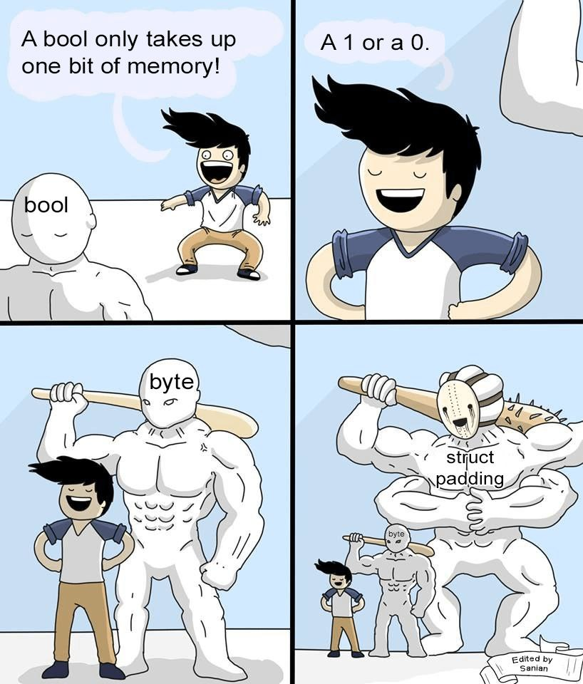

# Содержание

1. Выравнивание, layout структур, кэшлинии
1. Проверяем endianness
1. Проверяем представления float-ов
1. Арифметика флоатов, soft floats
1. Юникод, UTF-8

# Ссылки

1. [The lost Art of Structure Packing](http://www.catb.org/esr/structure-packing/)
1. [Data alignment: Straighten up and fly right](https://developer.ibm.com/articles/pa-dalign/)
1. [C Isn't A Programming Language Anymore](https://faultlore.com/blah/c-isnt-a-language/#c-doesnt-actually-have-an-abi)
1. ["compiler-rt" runtime libraries](https://compiler-rt.llvm.org/)
1. [What is Strict Aliasing and why we Care?](https://gist.github.com/shafik/848ae25ee209f698763cffee272a58f8)
1. [Линус жестко про strict aliasing rule](https://www.mail-archive.com/linux-btrfs@vger.kernel.org/msg01647.html)

---

